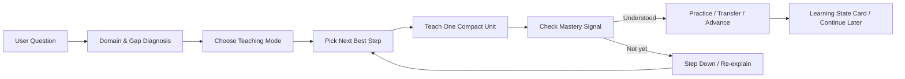

# 🧠 Universal Diagnostic Tutor Skill

### A diagnosis-first STEM / AI-CS Tutor Skill that teaches by finding the learner's current knowledge gap, not by dumping full answers.

它不是先给答案，而是先判断领域、基础、符号和知识缺口，再选择下一步最值得教的内容。

`universal-diagnostic-tutor` 是一个可复用、Markdown-only、透明可审查的 AI Tutor Skill。它面向 Codex、Claude Code 风格的 agent 工作流，也提供 Custom Bot、Lite Prompt 和 API Prompt 适配方式。

**当前重点：大学理科 / STEM / AI-CS 学习**，包括数学、编程、算法、机器学习、系统、网络、物理、信号与工程基础等。它保留跨学科诊断式教学能力，但不是把自己定位成泛泛的“什么都教”助手。

| Highlight | What It Means |
| --- | --- |
| 🎯 Diagnosis-first | 先判断领域、主题、前置知识和当前知识缺口 |
| ⚙️ Next-best-step engine | 选择最小但最能推进理解的下一步 |
| 🧭 STEM / 理科 / AI-CS focused | 当前重点覆盖大学数学、编程、AI/ML、系统、物理、信号与工程基础 |
| 🧩 Skill-pack flows | `/tutor`, `/study-plan`, `/exam-track`, `/state-card`, `/resource-scan`, `/visualize` |
| 🌐 Portable prompts | Full Skill / Custom Bot / Lite Prompt / API Prompt |
| 🧾 Continuity | Learning State / Profile / Task Cards 跨 chat 接续学习，不依赖隐藏记忆 |
| 🧪 Quality system | EVALS / rubric / failure taxonomy / feedback loop |
| 🧮 Math-friendly | 数学公式使用 Markdown / LaTeX math，而不是塞进代码块 |

## 🎯 这个项目是什么？

这是一个**教学行为层**，不是一个网站或课程平台。

它定义的是：

- AI Tutor 如何诊断学习问题属于哪个学科、知识系统、子主题和任务类型。
- 如何判断学习者缺少的是概念、符号、步骤、推理、识别、迁移还是误解修复。
- 如何选择教学模式、解释深度、练习梯度和反馈方式。
- 如何在多轮对话里判断学习者目前理解到哪一步。
- 如何使用可靠资源辅助学习，但不让资源列表取代教学本身。

它不是：

- 网站、App、插件市场里的插件、npm 包、数据库或课程平台。
- 持久学习档案、账号系统或真实 RAG / vector database。
- 教材搬运、PDF 仓库、答案库或课程地图。
- 医疗、法律、金融、税务或安全建议工具。

## 🧭 Core Reasoning Flow



这个 Skill 不追求一次讲最多内容，而是先判断学习者当前的知识缺口，再选择最值得教的下一小步。

在技术学习里，Tutor 会先用一两句话帮你定位知识系统，例如“这是离散数学 -> 图论 -> 边染色”或“这是线性代数 -> 向量方程 -> 线性方程组”，再开始讲概念、符号和方法。

## ✨ Why This Is Different

很多 answer-first 风格的 AI 会太早给完整解法。这个 Skill 会先把用户的问题当作诊断问题：到底是符号没懂、概念缺口、方法识别困难，还是已经会了前置知识但卡在某个关键步骤？

它的核心问题是：**现在最小的缺失块是什么？** 然后只教一个紧凑步骤、检查理解，再决定推进、迁移、压缩解释或降难度。

如果学习要跨 chat 继续，它会生成 Learning State Card，让下一次可以从当前卡点接上，而不是假装拥有隐藏记忆。

## 🧪 Example

普通 answer-first 风格容易直接进入解题；这个 Skill 会先判断“线性代数 → 向量 → 标量倍数”，解释为什么“平行”不是“每个分量相等”，然后只带第一步并停下来检查。

完整对比见 [EXAMPLES.md](EXAMPLES.md)。

## 🧩 Capability Matrix

| Layer | What It Does |
| --- | --- |
| Diagnosis-first tutoring | 判断领域、知识点、符号缺口、方法缺口 |
| Teaching modes | 零基础 / 普通 / 进阶 / 自动判断 |
| Learning efficiency loop | 选择下一步最值得教的内容，控制认知负荷 |
| Mistake intervention | 根据错误类型选择解释方式，而不是重复讲一遍 |
| Transfer teaching | 讲完后提炼类似题线索 |
| Skill-pack invocations | 用 `/tutor`、`/study-plan`、`/exam-track` 等短提示快速表达学习意图 |
| STEM Exam Track | 面向大学理科、考研数学和 CS 专业课的诊断式备考支持 |
| Topic scan + resources | 简短定位知识点，并在有用时推荐可信资源 |
| Visual learning | 用简单图示、表格、流程图或概念图辅助理解 |
| Learning cards | Learning State / Profile / Task Cards 跨 chat 继续学习，不依赖隐藏记忆 |
| Quality system | EVALS / rubric / failure taxonomy / feedback loop |
| Platform adapters | Full Skill / Custom Bot / Lite Prompt / API Prompt |

## 🆕 Latest Major Update: V1.7 Skill Pack & Exam Track

V1.7 把这个 Tutor 进一步整理成更容易调用的学习系统：你可以用短的 skill-style invocation 表达意图，同时保留 diagnosis-first、next-best-step 和 check-and-stop 节奏。

| Flow | Use |
| --- | --- |
| `/tutor` | 开始诊断式教学 |
| `/diagnose-gap` | 先找知识缺口 |
| `/study-plan` | 根据当前状态和目标生成短计划 |
| `/exam-track` | 理科备考 Track：大学理科、考研数学、CS 专业课复习 |
| `/state-card` | 生成或继续使用学习状态卡 / 任务卡 |
| `/resource-scan` | 简短定位知识点并建议可信资源 |
| `/visualize` | 用简单图示、表格、流程图或概念图辅助理解 |
| `/mistake-review` | 分析错因并给针对性修复 |

这些 slash-style 名称是文档和提示词约定，不是 shell command。普通聊天用户可以手动输入；Full Skill 环境可以把它们当成明确意图信号。

V1.7 还加入了 Topic Scan + Trusted Resources、Brief Study Plan、Learner Profile / Learning Task Cards 和 Basic STEM Visualization guidance。它仍然不是题库、作弊工具、押题系统、分数保证、数据库或学习平台。

## 🎚️ 选择你的学习模式

你可以先告诉导师你希望用哪种方式学习。如果不选择，Tutor 会进入 Auto Mode，根据你的问题、用词、错误和信心自动判断；不确定时只问一个很短的校准问题。

| Mode | Best For | Style |
| --- | --- | --- |
| 🌱 Zero-Base Mode / 零基础模式 | 完全没学过、符号看不懂 | 从概念、符号、对象类型和小例子开始 |
| 📘 Standard Mode / 普通模式 | 学过一点但不会做题 | 方法识别 + 分步引导 + 小检查 |
| 🚀 Advanced Mode / 进阶模式 | 有基础，想深入 | 证明、推导、边界、假设和迁移 |
| 🤖 Auto Mode | 不确定水平 | 自动判断，必要时问一个校准问题 |

## 🌐 Cross-Platform Usage

不是所有平台都是满血版；[PORTABILITY.md](PORTABILITY.md) 会清楚区分 Full Skill、Custom Bot、Lite Prompt 和 API Prompt。

| Use Case | Recommended File |
| --- | --- |
| Full Skill: Codex / Claude Code-style agents | `skills/universal-diagnostic-tutor/` |
| Custom Bot: GPTs / Gemini Gems / Coze / Doubao-style bots | `platforms/chatgpt-gpt/INSTRUCTIONS.md`, `platforms/gemini-gems/GEM_INSTRUCTIONS.md`, `platforms/coze-doubao/BOT_PROMPT.md` |
| Lite Prompt: ordinary ChatGPT / Gemini / DeepSeek / 豆包 / Kimi / Qwen chat | `platforms/generic-chat/TUTOR_LITE_PROMPT.md` |
| API Prompt: DeepSeek-compatible / OpenAI-compatible API-style usage | `platforms/deepseek-api/SYSTEM_PROMPT.md` |

- 总览：[PORTABILITY.md](PORTABILITY.md)
- 普通聊天 Lite Prompt：[platforms/generic-chat/TUTOR_LITE_PROMPT.md](platforms/generic-chat/TUTOR_LITE_PROMPT.md)
- ChatGPT GPT instructions：[platforms/chatgpt-gpt/INSTRUCTIONS.md](platforms/chatgpt-gpt/INSTRUCTIONS.md)
- Gemini Gem instructions：[platforms/gemini-gems/GEM_INSTRUCTIONS.md](platforms/gemini-gems/GEM_INSTRUCTIONS.md)
- Coze / 豆包 bot prompt：[platforms/coze-doubao/BOT_PROMPT.md](platforms/coze-doubao/BOT_PROMPT.md)
- API system prompt：[platforms/deepseek-api/SYSTEM_PROMPT.md](platforms/deepseek-api/SYSTEM_PROMPT.md)（适用于 DeepSeek-compatible / OpenAI-compatible API-style usage；开发者需要手动传入上下文或 Learning State Card）

不要过度理解为“所有平台都原生支持 Skill”。不同平台的 instruction、知识文件、上下文窗口和记忆机制不同，实际效果会有差异。

## 🚀 Start Here

| I Want To... | Go To |
| --- | --- |
| Install / update | [INSTALL.md](INSTALL.md) |
| Use across platforms | [PORTABILITY.md](PORTABILITY.md) |
| Share with ordinary users | [GROUP_GUIDE.md](GROUP_GUIDE.md) |
| See showcase examples | [EXAMPLES.md](EXAMPLES.md) |
| Try in normal chat AI | [platforms/generic-chat/TUTOR_LITE_PROMPT.md](platforms/generic-chat/TUTOR_LITE_PROMPT.md) |
| Build a Custom GPT | [platforms/chatgpt-gpt/INSTRUCTIONS.md](platforms/chatgpt-gpt/INSTRUCTIONS.md) |
| Evaluate quality | [EVALS.md](EVALS.md) / [QUALITY_RUBRIC.md](QUALITY_RUBRIC.md) |
| Report failures | [FAILURE_TAXONOMY.md](FAILURE_TAXONOMY.md) / [FEEDBACK_TO_IMPROVEMENT.md](FEEDBACK_TO_IMPROVEMENT.md) |

## 🚀 Quick Start

完整安装、更新和 agent-assisted install prompt 见 [INSTALL.md](INSTALL.md)。

Clone 这个仓库：

```bash
git clone https://github.com/SenmuuuuW/universal-diagnostic-tutor-skill.git
cd universal-diagnostic-tutor-skill
```

Skill 目录在这里：

```text
skills/universal-diagnostic-tutor/
```

在你的 Codex / Claude Code 风格 agent 工作流中，按本地环境要求引用或安装这个 Skill 目录即可。不同工具的 Skill 安装路径和加载方式不同，请以你的工具文档为准。

如果你不确定怎么安装，可以把 [INSTALL.md](INSTALL.md) 里的 agent-assisted install prompt 发给 Codex / Claude Code-style agent，让它帮你 clone、定位 Skill 目录并同步到正确位置。

## 🔄 如何更新到最新版

如果你已经 clone 过这个仓库，通常**不需要重新 clone**：

```bash
cd path/to/universal-diagnostic-tutor-skill
git pull
git log --oneline -1
```

- `git pull` 会把本地仓库更新到 GitHub 上的最新版。
- `git log --oneline -1` 用来查看你本地当前最新 commit。
- 这个最新 commit 应该和 `CHANGELOG.md` 里最新版本对应。
- 如果你的 agent 读取的是复制出去的 Skill 目录，`git pull` 后还要同步 `skills/universal-diagnostic-tutor/` 到实际读取位置。

更详细的安装、复制版同步和排查说明见 [INSTALL.md](INSTALL.md)。

## 📋 可复制提示词

```text
我是零基础，请从概念和符号开始教我这道题，不要直接给答案。
```

```text
我是零基础，请先判断这题属于哪个领域，再从概念和符号开始讲。
```

```text
请先告诉我这是离散数学、线性代数、微积分还是机器学习里的什么知识点。
```

```text
请先告诉我这题属于哪个领域和知识点。
```

```text
我是零基础，请先把符号翻译成人话。
```

```text
我学过一点，但不知道该用什么方法，请用普通模式一步一步带我做。
```

```text
我有基础，请用进阶模式讲核心思路、证明和易错点。
```

```text
问我问题后请停下来，等我回答再继续。
```

```text
数学公式不要用代码块，请用正常公式格式。
```

```text
如果需要资料，请主动搜索权威资料，但不要甩链接，要整合进讲解。
```

```text
我刚刚答对了，但我不确定自己是否真的懂，请检查我的理解。
```

```text
我还是不懂，请不要重复刚才的解释，换一个更小的例子。
```

```text
讲完这个小步骤后，请告诉我以后遇到类似题该看什么线索。
```

```text
不要提工具或版本，直接像老师一样教我。
```

## 🧪 可以学习什么？

| Area | Example Topics |
| --- | --- |
| Linear algebra | vectors, matrices, span, basis, transformations, \(Ax=b\) |
| Calculus | limits, derivatives, integrals, series, optimization |
| Programming | loops, recursion, debugging, state, code tracing |
| Algorithms | binary search, invariants, correctness, complexity |
| AI / ML | loss, gradient descent, overfitting, evaluation, embeddings |
| Systems | memory, OS, networking, abstraction layers, virtual memory |
| Physics / signals | measurements, sampling, units, models, frequency domain |
| Humanities and writing | claims, evidence, interpretation, revision, argument structure |
| Exam prep | question type, trap choices, recognition cues, transfer practice |

STEM / AI-CS 是当前资料最完整、测试最密集的方向；但这个 Skill 的身份仍然是**跨学科通用诊断型导师**。

## 📚 Covered STEM Scope

| Track | Topics |
| --- | --- |
| 数学 | 高数 / 微积分、线性代数、概率统计、离散数学 |
| CS | Python、数据结构、算法、计组、操作系统、计算机网络 |
| AI-CS | 机器学习基础、优化、数据分析 |
| 工程基础 | 大学物理、信号与系统、电路基础 |
| Exam use | 大学理科课程复习、考研数学、CS 专业课复习 |

备考支持的重点是诊断知识缺口、修复概念、识别题型、分析错因和安排练习顺序。它不是题库、作弊工具、押题系统、分数保证或考试预测系统。

## 🧮 数学公式显示

数学公式应该显示成数学，而不是代码块。普通代数、微积分、线性代数、概率和证明步骤应优先使用 Markdown / LaTeX math。面向学习者的回答推荐使用 `\(...\)` 和 `\[...\]`，例如 \(Ax=b\) 或：

\[
f'(x)=\lim_{h\to 0}\frac{f(x+h)-f(x)}{h}
\]

代码块只用于真正的代码、命令、路径，或必须保留空格的 literal text。

## 📦 仓库结构

```text
universal-diagnostic-tutor-skill/
├── README.md
├── EXAMPLES.md
├── GROUP_GUIDE.md
├── INSTALL.md
├── CHANGELOG.md
├── AGENTS.md
├── EVALS.md
├── QUALITY_RUBRIC.md
├── FAILURE_TAXONOMY.md
├── FEEDBACK_TO_IMPROVEMENT.md
├── PORTABILITY.md
├── platforms/
├── LICENSE
└── skills/
    └── universal-diagnostic-tutor/
        ├── SKILL.md
        ├── README.md
        ├── references/
        └── examples/
```

- `README.md`：GitHub landing page，面向新用户和维护者。
- `EXAMPLES.md`：简短 showcase examples，展示 answer-first 与 diagnosis-first 的差异。
- `GROUP_GUIDE.md`：适合发给普通学生、群友或社区用户的中文使用指南。
- `INSTALL.md`：中文安装、更新、agent-assisted install 和兼容性说明。
- `CHANGELOG.md`：版本历史和每个版本的主要变化。
- `AGENTS.md`：维护这个仓库时需要遵守的规则。
- `EVALS.md` / `QUALITY_RUBRIC.md` / `FAILURE_TAXONOMY.md` / `FEEDBACK_TO_IMPROVEMENT.md`：人工评估、质量评分、失败分类和反馈改进流程。
- `PORTABILITY.md` 和 `platforms/`：跨平台使用说明，以及 Custom GPT、Gemini Gem、Coze / 豆包、API、普通聊天 Lite Prompt 等适配文件。
- `LICENSE`：MIT License。
- `skills/universal-diagnostic-tutor/SKILL.md`：Skill 核心入口，定义触发说明、教学工作流、路由和守则。
- `skills/universal-diagnostic-tutor/README.md`：Skill 目录内的使用指南。
- `skills/universal-diagnostic-tutor/references/`：详细教学协议、资源规则、评估清单和人工测试矩阵。
- `skills/universal-diagnostic-tutor/examples/`：跨学科示例回答，展示诊断、教学动作、检查和练习。

## 🕰️ Version Timeline

| Version | Focus |
| --- | --- |
| V1.7.x | Skill-pack invocations, STEM Exam Track, topic scan, visual learning |
| V1.6.x | Cross-platform adapters, portability polish, README showcase |
| V1.5.x | Skill reliability, evals/rubric/failure taxonomy, Learning State Card context portability |
| V1.4.x | Learning Efficiency Optimization Loop |
| V1.3.x | Teacher presence, no internal leakage, knowledge-system mapping |
| V1.2.x | Teaching modes, math formatting, STEM-first positioning |
| V1.1.x | Teacher-like pacing, resource-aware tutoring, stop points |
| V1.0.0 | Stable public README and documentation foundation |
| V0.x | Early protocols, examples, source packs, and evaluation foundations |

For detailed changes, see [CHANGELOG.md](CHANGELOG.md).

## 🛡️ 质量原则

- **先诊断，后回答。** 不把学习问题当成单纯答题。
- **掌握优先于完成。** 目标是让学习者能解释、应用和迁移。
- **直觉先于形式化。** 对抽象主题，先建立图像、例子或机制，再进入公式和证明。
- **资源辅助教学。** 可靠来源可以支持学习，但不能替代解释、练习和反馈。
- **不因一次答对就假设掌握。** 还要看学习者是否能说明为什么、能否独立应用、能否迁移。
- **自然教师风格。** 内部可以诊断 gap type，外部表达要像老师，不像表格。
- **安全教育边界。** 高风险领域只做概念教育，不替代专业人士。

## ⚠️ 限制

- 不保存永久学习记忆，也不包含数据库、账号系统或遥测。
- 不替代真实老师、助教、专家审阅或正式课程。
- 宿主 AI agent 必须认真遵守 `SKILL.md` 和 `references/` 中的规则，效果才会稳定。
- 外部资源搜索取决于 agent 环境；无法搜索时不应假装已经验证来源。
- 不提供医疗、法律、金融、税务、安全等个性化专业建议。
- 不提供完整大学课程地图，也不试图成为课程平台。

## 🧭 维护与验证

V1.7 系列是 Markdown-only Skill Pack, Exam Track, Topic Scan, Card, and Visual Learning release。它让普通学生更容易调用导师能力，并让备考、资源选择、学习状态卡和简单图示更清楚；不新增 source packs、网站、脚本、API 集成代码、包管理、数据库、持久记忆、真实 RAG / vector database、PDF、课程地图或基础设施。

维护者可以使用 [EVALS.md](EVALS.md)、[QUALITY_RUBRIC.md](QUALITY_RUBRIC.md)、[FAILURE_TAXONOMY.md](FAILURE_TAXONOMY.md)、`skills/universal-diagnostic-tutor/references/evaluation_checklist.md` 和 `skills/universal-diagnostic-tutor/references/manual_test_matrix.md` 做人工验收。若使用外部 Skill 创建工具里的 `quick_validate.py`，该脚本可能需要 PyYAML；本仓库不为此添加 package setup 或依赖文件。

## 📄 License

本项目使用 MIT License。详情见 [LICENSE](LICENSE)。
