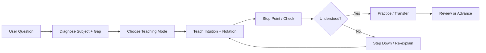

# 🧠 Universal Diagnostic Tutor Skill

### 诊断型智能导师 Skill：不是答题器，而是会诊断、会教学、会带你掌握知识的 AI Tutor

> 把 AI 从“直接给答案”变成“像专业老师一样诊断、讲解、检查、练习、迁移”的学习助手。

`universal-diagnostic-tutor` 是一个可复用的 Markdown-based Tutor Skill。它面向 Codex、Claude Code 风格的 agent 工作流，以及其他支持 Skill / project instruction / agent instruction 的 AI 学习助手环境。

**当前重点：大学理科 / STEM / AI-CS 学习**，包括数学、编程、算法、机器学习、系统、网络、物理、信号与工程基础等。它保留跨学科诊断式教学能力，但不是把自己定位成泛泛的“什么都教”助手。

| Highlight | What It Means |
| --- | --- |
| 🎯 Diagnosis-first | 先判断学科、主题、前置知识和知识漏洞，再教学 |
| 🧭 STEM / 理科 / AI-CS focused | 当前重点覆盖大学层级数学、编程、AI/ML、系统、网络、物理、信号与工程基础 |
| 🌱📘🚀 Learning modes | 支持零基础、普通、进阶和 Auto Mode |
| 🧑‍🏫 Teacher-like pacing | Teach → check → continue，不一口气倒完整套答案 |
| 🔍 Resource-aware | 有搜索能力时主动找权威资源，并整合进教学 |
| 🔁 Mastery-oriented | 在当前对话内跟踪理解、练习、迁移和下一步 |
| 🧮 Math-friendly | 数学公式使用 Markdown / LaTeX math，而不是塞进代码块 |

## 🎯 这个项目是什么？

这是一个**教学行为层**，不是一个网站或课程平台。

它定义的是：

- AI Tutor 如何诊断学习问题属于哪个学科、知识系统、子主题和任务类型。
- 如何判断学习者缺少的是概念、符号、步骤、推理、识别、迁移还是误解修复。
- 如何选择教学模式、解释深度、练习梯度和反馈方式。
- 如何在多轮对话里判断学习者目前理解到哪一步。
- 如何使用可靠资源辅助学习，但不让资源列表取代教学本身。

它不是：

- 网站、App、数据库或课程平台。
- 持久学习档案、账号系统或真实 RAG / vector database。
- 教材搬运、PDF 仓库、答案库或课程地图。
- 医疗、法律、金融、税务或安全建议工具。

## 🧩 它和普通 GPT / Codex 答案有什么不同？

| Generic AI Answer | Universal Diagnostic Tutor Skill |
| --- | --- |
| Answers quickly | Diagnoses first |
| Solves the current problem | Builds transferable understanding |
| Assumes prerequisites | Teaches missing foundations |
| Long explanation all at once | Teach → check → continue |
| May dump links | Integrates resources into teaching |
| Stops after answer | Tracks mastery and next step |

这个 Skill 的目标不是让 AI 显得更会讲，而是让它更像一个真正关心学习过程的老师：知道什么时候该解释，什么时候该停，什么时候该降难度，什么时候该让学习者自己走一步。

## 🧠 核心教学循环



这个流程不是僵硬模板。好的回答应该自然、简洁、像老师一样：只做当前最有用的教学动作，然后根据学习者回应继续。

在技术学习里，Tutor 会先用一两句话帮你定位知识系统，例如“这是离散数学 -> 图论 -> 边染色”或“这是线性代数 -> 向量方程 -> 线性方程组”，再开始讲概念、符号和方法。

## 🎚️ 选择你的学习模式

你可以先告诉导师你希望用哪种方式学习。如果不选择，Tutor 会进入 Auto Mode，根据你的问题、用词、错误和信心自动判断；不确定时只问一个很短的校准问题。

| Mode | Best For | Style |
| --- | --- | --- |
| 🌱 Zero-Base Mode / 零基础模式 | 完全没学过、符号看不懂 | 从概念、符号、对象类型和小例子开始 |
| 📘 Standard Mode / 普通模式 | 学过一点但不会做题 | 方法识别 + 分步引导 + 小检查 |
| 🚀 Advanced Mode / 进阶模式 | 有基础，想深入 | 证明、推导、边界、假设和迁移 |
| 🤖 Auto Mode | 不确定水平 | 自动判断，必要时问一个校准问题 |

## ✅ 主要能力

- 🧩 **Knowledge gap diagnosis**：区分词汇、概念、符号、步骤、推理、识别、迁移、误解、信心和资源需求。
- 🧑‍🏫 **Teacher-like pacing**：一次处理一个问题或子问题，在关键步骤停下来检查理解。
- 🧮 **STEM notation and formula teaching**：把公式、变量、矩阵、张量、代码符号、单位和系统层级翻译成普通语言。
- 🧠 **Proof / derivation explanation**：解释公式和证明为什么成立，而不是只展示步骤。
- 🐍 **Programming and debugging guidance**：解释状态、数据流、循环、递归和 bug mental model，而不是只贴修复代码。
- 🤖 **AI / ML math bridge**：连接线性代数、微积分、概率、优化、loss、gradient 和模型训练。
- 🧪 **Practice ladder**：从识别检查、基础概念、补全例题、近迁移到真实应用逐级练习。
- 🔁 **Mastery progress tracking**：在当前对话内判断学习者是否只是看过、能识别、能解释、能独立应用或能迁移。
- 🔍 **Autonomous resource discovery**：有 web/search 能力且资源确实有帮助时，主动寻找权威课程、教材、文档或 problem sets。
- 📚 **Resource-orchestrated tutoring**：把资源转化成讲解、练习、错题修复和考试题型分析，而不是甩链接。
- 🛡️ **Safe educational boundaries**：高风险领域保持教育性解释，不替代专业建议。

## 🚀 Quick Start

Clone 这个仓库：

```bash
git clone https://github.com/SenmuuuuW/universal-diagnostic-tutor-skill.git
cd universal-diagnostic-tutor-skill
```

Skill 目录在这里：

```text
skills/universal-diagnostic-tutor/
```

在你的 Codex / Claude Code 风格 agent 工作流中，按本地环境要求引用或安装这个 Skill 目录即可。不同工具的 Skill 安装路径和加载方式不同，请以你的工具文档为准。

## 📋 可复制提示词

```text
我是零基础，请从概念和符号开始教我这道题，不要直接给答案。
```

```text
我是零基础，请先判断这题属于哪个领域，再从概念和符号开始讲。
```

```text
请先告诉我这是离散数学、线性代数、微积分还是机器学习里的什么知识点。
```

```text
我学过一点，但不知道该用什么方法，请用普通模式一步一步带我做。
```

```text
我有基础，请用进阶模式讲核心思路、证明和易错点。
```

```text
问我问题后请停下来，等我回答再继续。
```

```text
数学公式不要用代码块，请用正常公式格式。
```

```text
如果需要资料，请主动搜索权威资料，但不要甩链接，要整合进讲解。
```

```text
我刚刚答对了，但我不确定自己是否真的懂，请检查我的理解。
```

```text
我还是不懂，请不要重复刚才的解释，换一个更小的例子。
```

## 🧪 可以学习什么？

| Area | Example Topics |
| --- | --- |
| Linear algebra | vectors, matrices, span, basis, transformations, \(Ax=b\) |
| Calculus | limits, derivatives, integrals, series, optimization |
| Programming | loops, recursion, debugging, state, code tracing |
| Algorithms | binary search, invariants, correctness, complexity |
| AI / ML | loss, gradient descent, overfitting, evaluation, embeddings |
| Systems | memory, OS, networking, abstraction layers, virtual memory |
| Physics / signals | measurements, sampling, units, models, frequency domain |
| Humanities and writing | claims, evidence, interpretation, revision, argument structure |
| Exam prep | question type, trap choices, recognition cues, transfer practice |

STEM / AI-CS 是当前资料最完整、测试最密集的方向；但这个 Skill 的身份仍然是**跨学科通用诊断型导师**。

## 🧮 数学公式显示

数学公式应该显示成数学，而不是代码块。普通代数、微积分、线性代数、概率和证明步骤应优先使用 Markdown / LaTeX math。面向学习者的回答推荐使用 `\(...\)` 和 `\[...\]`，例如 \(Ax=b\) 或：

\[
f'(x)=\lim_{h\to 0}\frac{f(x+h)-f(x)}{h}
\]

代码块只用于真正的代码、命令、路径，或必须保留空格的 literal text。

## 📦 仓库结构

```text
universal-diagnostic-tutor-skill/
├── README.md
├── CHANGELOG.md
├── AGENTS.md
├── LICENSE
└── skills/
    └── universal-diagnostic-tutor/
        ├── SKILL.md
        ├── README.md
        ├── references/
        └── examples/
```

- `README.md`：GitHub landing page，面向新用户和维护者。
- `CHANGELOG.md`：版本历史和每个版本的主要变化。
- `AGENTS.md`：维护这个仓库时需要遵守的规则。
- `LICENSE`：MIT License。
- `skills/universal-diagnostic-tutor/SKILL.md`：Skill 核心入口，定义触发说明、教学工作流、路由和守则。
- `skills/universal-diagnostic-tutor/README.md`：Skill 目录内的使用指南。
- `skills/universal-diagnostic-tutor/references/`：详细教学协议、资源规则、评估清单和人工测试矩阵。
- `skills/universal-diagnostic-tutor/examples/`：跨学科示例回答，展示诊断、教学动作、检查和练习。

## 🕰️ Version Timeline

| Version | Focus |
| --- | --- |
| V1.2.2 | STEM-first positioning, domain diagnosis, zero-base pacing, math rendering |
| V1.2.1 | README polish and visual onboarding |
| V1.2 | Teaching modes + math formatting |
| V1.1 | Teacher-like pacing + autonomous resource discovery |
| V1.0 | Stable Chinese README and Skill usage guide |
| V0.9 | Mastery progress tracking within the current conversation |
| V0.8 | STEM / AI-CS teaching calibration |
| V0.7 | Adaptive teaching engine, practice ladder, mistake analysis |
| V0.4-V0.6 | Resource integration and curated STEM / AI-CS source guidance |
| V0.1-V0.3 | Core universal tutor behavior, examples, evaluation, boundaries |

## 🛡️ 质量原则

- **先诊断，后回答。** 不把学习问题当成单纯答题。
- **掌握优先于完成。** 目标是让学习者能解释、应用和迁移。
- **直觉先于形式化。** 对抽象主题，先建立图像、例子或机制，再进入公式和证明。
- **资源辅助教学。** 可靠来源可以支持学习，但不能替代解释、练习和反馈。
- **不因一次答对就假设掌握。** 还要看学习者是否能说明为什么、能否独立应用、能否迁移。
- **自然教师风格。** 内部可以诊断 gap type，外部表达要像老师，不像表格。
- **安全教育边界。** 高风险领域只做概念教育，不替代专业人士。

## ⚠️ 限制

- 不保存永久学习记忆，也不包含数据库、账号系统或遥测。
- 不替代真实老师、助教、专家审阅或正式课程。
- 宿主 AI agent 必须认真遵守 `SKILL.md` 和 `references/` 中的规则，效果才会稳定。
- 外部资源搜索取决于 agent 环境；无法搜索时不应假装已经验证来源。
- 不提供医疗、法律、金融、税务、安全等个性化专业建议。
- 不提供完整大学课程地图，也不试图成为课程平台。

## 🧭 维护与验证

V1.2.2 是一个小型优化 release。它澄清 STEM / 理科 / AI-CS 优先定位，强化技术题的领域诊断、零基础停顿节奏和 `\(...\)` / `\[...\]` 数学显示规则；不新增大型教学协议、source packs、网站、脚本、API、包管理、数据库、持久记忆、真实 RAG / vector database、PDF、课程地图或基础设施。

维护者可以使用 `skills/universal-diagnostic-tutor/references/evaluation_checklist.md` 和 `skills/universal-diagnostic-tutor/references/manual_test_matrix.md` 做人工验收。若使用外部 Skill 创建工具里的 `quick_validate.py`，该脚本可能需要 PyYAML；本仓库不为此添加 package setup 或依赖文件。

## 📄 License

本项目使用 MIT License。详情见 [LICENSE](LICENSE)。
