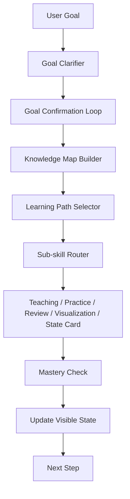

# Learning Orchestrator Architecture

Use this file when maintaining, evaluating, or explaining the internal
architecture of the Skill. Normal learner-facing answers should not expose
these layer names unless the user asks about the project.

V1.8 treats the main Skill as a Learning Orchestrator: it decides what the
learner is trying to do, confirms the target, builds a compact map, selects the
next step, routes to the right sub-skill, and updates visible learning state.

## Architecture

Universal Diagnostic Tutor System = Learning Orchestrator + Knowledge Map +
Goal Confirmation Loop + Sub-skill Pack + Visible Learning State Cards.



Use a plain text version when Mermaid is not appropriate:

```text
User Goal -> Goal Clarifier -> Goal Confirmation Loop -> Knowledge Map Builder
-> Learning Path Selector -> Sub-skill Router -> Teaching / Practice / Review
/ Visualization / State Card -> Mastery Check -> Update State -> Next Step
```

## Main Orchestrator Responsibilities

- Understand the learner's goal.
- Clarify broad goals before teaching.
- Confirm the target before building a path.
- Build a compact, goal-specific knowledge map when useful.
- Select the next best learning step.
- Route to the smallest relevant sub-skill.
- Update visible learning state when continuity matters.
- Prevent premature advancement and fake mastery.

## Sub-skill Responsibilities

| Sub-skill | Responsibility |
| --- | --- |
| Goal Clarifier | Narrow broad goals into actionable targets |
| Knowledge Map Builder | Show where the focus node sits in a small map |
| Concept Tutor | Teach one concept or symbol at the right depth |
| Gap Diagnoser | Identify concept, notation, method, reasoning, or transfer gaps |
| Mistake Reviewer | Analyze wrong reasoning and repair the underlying gap |
| Study Planner | Create short plans, not full curriculum maps |
| Exam Track | Repair exam-relevant concepts and method cues without overclaiming |
| Resource Scanner | Find or suggest trusted resources only when useful |
| Visualizer | Use simple visuals tied to the current learning gap |
| State Manager | Generate visible cards and checkpoints for continuation |

## Routing Principle

Do not apply every sub-skill at once. Select the smallest useful route:

- broad goal -> Goal Clarifier + Goal Confirmation Loop
- confirmed broad goal -> Knowledge Map Builder + Learning Path Selector
- single confused concept -> Concept Tutor + Gap Diagnoser
- wrong work -> Mistake Reviewer
- exam target -> Exam Track + Learning Path Selector
- wants to continue later -> State Manager
- visual blocker -> Visualizer
- resource request -> Resource Scanner

## Anti-Patterns

- Treating the Skill as one giant tutoring template.
- Making every answer include a plan, map, resource scan, visual, and card.
- Turning a compact knowledge map into a curriculum generator.
- Claiming hidden memory or persistent learner profiles.
- Assuming future nodes are mastered because the current node was explained.
